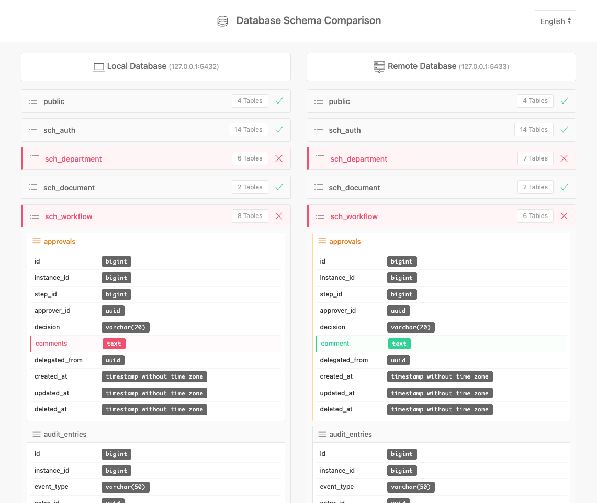

# Schema Diff Tool

A modern, extensible web application for comparing database schemas between local and remote environments. Supports multiple database systems through an adapter architecture.


## Features

- 🔍 **Schema Comparison** - Compare database schemas between local and remote databases
- 🔌 **Pluggable Adapters** - Support for multiple database systems (PostgreSQL, MySQL, MSSQL, etc.)
- 📊 **Visual Diff** - Easy-to-read visual representation of differences
- 🎯 **Column Type Detection** - Displays column names and their precise data types
- 🔄 **Synchronized Navigation** - Expand a schema on one side, and the same schema opens on the other side
- 🌐 **Cross-Database Compare** - Compare PostgreSQL to MySQL, or any supported combination!
- 🌍 **Multi-Language Support** - Available in English and Turkish (easily extensible to other languages)
- 📱 **Responsive Design** - Works on desktop, tablet, and mobile devices
- 🎨 **Modern UI** - Clean interface built with UIKit framework
- ⚡ **Fast & Lightweight** - No heavy dependencies, just vanilla PHP and JavaScript
- 🔧 **Extensible** - Easy to add support for new database systems

## Screenshots



*Schema comparison interface showing synchronized navigation and visual diff indicators*

## Quick Start

### Prerequisites

- PHP 7.4 or higher
- A supported database system (PostgreSQL, MySQL, etc.)
- Web server (Apache, Nginx, or PHP built-in server)
- Corresponding PHP database extension:
  - PostgreSQL: `php-pgsql`
  - MySQL/MariaDB: `php-mysqli` or `php-pdo_mysql`
  - MSSQL: `php-sqlsrv` or `php-pdo_sqlsrv`

### Installation

1. **Clone the repository**
   ```bash
   git clone https://github.com/fatihemre/database-schema-diff.git
   cd database-schema-diff
   ```

2. **Create configuration file**
   ```bash
   cp config.example.php config.php
   ```

3. **Edit configuration**
   Open `config.php` and set your database credentials:
   ```php
   return [
       'local' => [
           'adapter' => 'PostgreSQLAdapter',  // Choose your database adapter
           'host' => '127.0.0.1',
           'port' => '5432',
           'dbname' => 'your_local_db',
           'user' => 'your_user',
           'password' => 'your_password'
       ],
       'remote' => [
           'adapter' => 'PostgreSQLAdapter',  // Can be different from local!
           'host' => 'remote.server.com',
           'port' => '5432',
           'dbname' => 'your_remote_db',
           'user' => 'your_user',
           'password' => 'your_password'
       ]
   ];
   ```

4. **Start the application**

   **Option A: PHP Built-in Server**
   ```bash
   php -S localhost:8000
   ```

   **Option B: Docker Compose** (recommended)
   ```bash
   docker-compose up
   ```

5. **Open in browser**
   ```
   http://localhost:8000
   ```

## Usage

1. **Configure Database Connections** - Edit `config.php` with your database credentials
2. **Open the Application** - Access via web browser
3. **View Comparison** - The tool automatically compares schemas and displays differences
4. **Navigate Schemas** - Click on schema headers to expand/collapse
5. **Identify Differences**:
   - 🔴 **Red** - Missing in remote (or different)
   - 🟢 **Green** - Extra in remote (or different)
   - 🟠 **Orange** - Column type mismatch

## Database Support

### Supported Databases

| Database | Status | Adapter | Notes |
|----------|--------|---------|-------|
| PostgreSQL | ✅ **Fully Supported** | `PostgreSQLAdapter` | Tested with 9.6+ |
| MySQL | 🚧 **Coming Soon** | `MySQLAdapter` | Skeleton available |
| MariaDB | 📋 **Planned** | `MariaDBAdapter` | Compatible with MySQLAdapter |
| MSSQL | 📋 **Planned** | `MSSQLAdapter` | Community contributions welcome |
| Oracle | 📋 **Planned** | `OracleAdapter` | Community contributions welcome |
| SQLite | 📋 **Planned** | `SQLiteAdapter` | Community contributions welcome |

### Using Different Adapters

You can compare databases of **different types**! For example:

```php
return [
    'local' => [
        'adapter' => 'PostgreSQLAdapter',
        'host' => 'localhost',
        'port' => '5432',
        // ...
    ],
    'remote' => [
        'adapter' => 'MySQLAdapter',  // Different database type!
        'host' => 'remote.example.com',
        'port' => '3306',
        // ...
    ]
];
```

### Creating Your Own Adapter

Want to add support for a new database? It's easy! See [Adapter Development Guide](adapters/ADAPTER_DEVELOPMENT_GUIDE.md) for step-by-step instructions.

**Quick steps:**
1. Create a new class extending `DatabaseAdapter`
2. Implement 6 required methods
3. Return data in the standard format
4. Test and submit a PR!

## Architecture

### Project Structure

```
schema-diff/
├── adapters/                          # 🔌 Database adapters
│   ├── DatabaseAdapter.php            # Abstract base class
│   ├── PostgreSQLAdapter.php          # PostgreSQL implementation
│   ├── MySQLAdapter.php               # MySQL skeleton
│   └── ADAPTER_DEVELOPMENT_GUIDE.md   # How to create adapters
├── docker/                            # Docker configuration
│   ├── init-local.sql
│   ├── init-remote.sql
│   ├── config.docker.php
│   └── README.md
├── lang/                              # 🌍 Language files
│   ├── en.php                         # English translations
│   └── tr.php                         # Turkish translations
├── api.php                            # REST API endpoint
├── lang.php                           # Language API endpoint
├── config.php                         # Database configuration (gitignored)
├── config.example.php                 # Example configuration
├── index.html                         # Main HTML file
├── script.js                          # Frontend JavaScript
├── style.css                          # Custom styles
├── README.md                          # This file
├── LICENSE                            # GPL v3 License
├── CONTRIBUTING.md                    # Contribution guidelines
├── CHANGELOG.md                       # Version history
└── docker-compose.yml                 # Docker setup
```

### Tech Stack

- **Backend**: PHP (vanilla, no framework)
- **Frontend**: HTML5, JavaScript (ES6+), UIKit 3
- **Database**: PostgreSQL, MySQL (coming soon), and more via adapters
- **API**: RESTful JSON API
- **Architecture**: Adapter Pattern for database abstraction

## API Endpoints

### GET `/api.php`

Returns comparison data in JSON format.

**Response:**
```json
{
  "success": true,
  "data": {
    "local": { ... },
    "remote": { ... },
    "schemaStatuses": { ... },
    "config": {
      "local": { "host": "...", "port": "..." },
      "remote": { "host": "...", "port": "..." }
    }
  }
}
```

### GET `/lang.php?lang=en`

Returns translations for the specified language.

**Parameters:**
- `lang` - Language code (e.g., `en`, `tr`)

**Response:**
```json
{
  "success": true,
  "lang": "en",
  "translations": {
    "app_title": "Database Schema Comparison",
    "local_database": "Local Database",
    "remote_database": "Remote Database",
    ...
  }
}
```

## Development

### Running Locally

```bash
# Install dependencies (none required!)
# Just configure and run

php -S localhost:8000
```

### Code Style

- PHP: PSR-12 coding standard
- JavaScript: ES6+ with consistent formatting
- CSS: BEM-like naming convention

## Contributing

We welcome contributions! Please see [CONTRIBUTING.md](CONTRIBUTING.md) for details.

### Quick Contribution Guide

1. Fork the repository
2. Create a feature branch (`git checkout -b feature/amazing-feature`)
3. Commit your changes (`git commit -m 'Add amazing feature'`)
4. Push to the branch (`git push origin feature/amazing-feature`)
5. Open a Pull Request

## Security

### Reporting Vulnerabilities

If you discover a security vulnerability, please send an email to [info@fatihemre.net](mailto:info@fatihemre.net). All security vulnerabilities will be promptly addressed.

### Best Practices

- Never commit `config.php` to version control
- Use strong database passwords
- Run the application over HTTPS in production
- Restrict database user permissions to read-only if possible

## License

This project is licensed under the GNU General Public License v3.0 - see the [LICENSE](LICENSE) file for details.

## Acknowledgments

- [UIKit](https://getuikit.com/) - Frontend framework
- [PostgreSQL](https://www.postgresql.org/) - Database system

## Support

- 📫 Email: [info@fatihemre.net](mailto:info@fatihemre.net)
- 🐛 Issues: [GitHub Issues](https://github.com/fatihemre/database-schema-diff/issues)
- 💬 Discussions: [GitHub Discussions](https://github.com/fatihemre/database-schema-diff/discussions)

## Roadmap

### Database Adapters (Community Contributions Welcome!)
- [x] PostgreSQL adapter (fully implemented)
- [ ] MySQL/MariaDB adapter (skeleton available - needs implementation)
- [ ] MSSQL adapter
- [ ] Oracle adapter
- [ ] SQLite adapter

### Localization
- [x] Multi-language support infrastructure
- [x] English (default)
- [x] Turkish
- [ ] Additional languages (community contributions welcome!)

### Comparison Features
- [ ] Table index comparison
- [ ] Foreign key comparison
- [ ] Trigger comparison
- [ ] View comparison
- [ ] Stored procedure comparison

### Export & Reporting
- [ ] Export comparison report (PDF/HTML)
- [ ] Generate migration SQL scripts
- [ ] CLI mode for CI/CD integration

### Advanced Features
- [ ] User authentication
- [ ] Multiple database pair comparison
- [ ] Automated schema migration suggestions
- [ ] Historical comparison tracking
- [ ] Diff annotations and comments

## Authors

- **Fatih Emre** - *Initial work* - [fatihemre](https://github.com/fatihemre)

## Changelog

See [CHANGELOG.md](CHANGELOG.md) for a list of changes.

---

Made with ❤️ by the community
